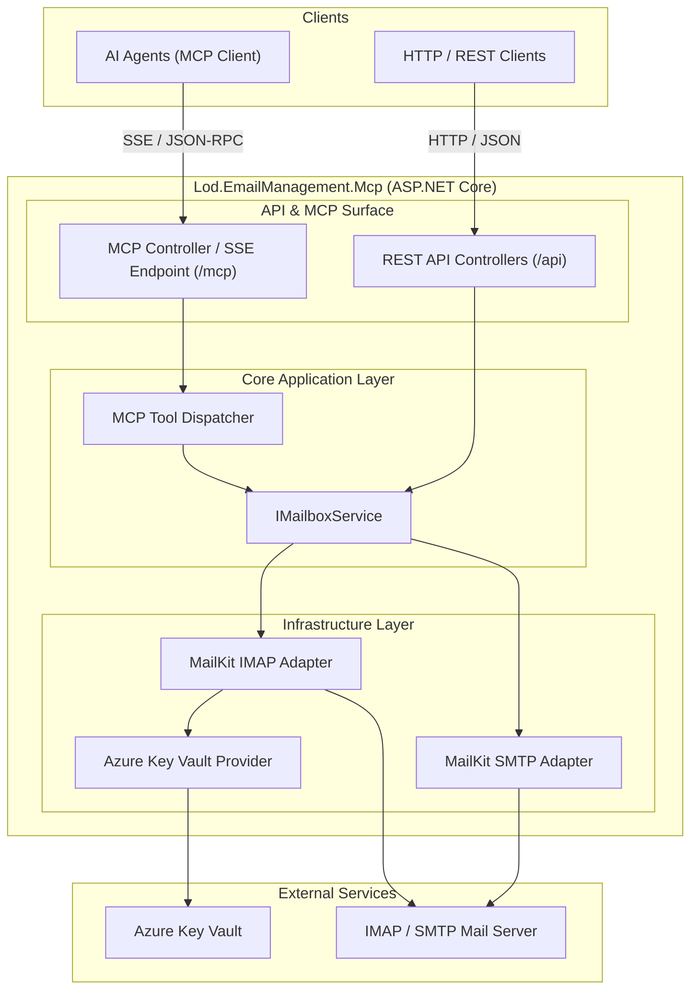

# Product Requirements Document (PRD)

Maintain this file as a living requirements and implementation document. Agents should update it as product understanding evolves.

## Project Overview

**Email Management MCP** is an ASP.NET Core Web API service that exposes a Model Context Protocol (MCP) server alongside standard RESTful endpoints. It enables autonomous AI agents and automated workflows to securely connect to, inspect, and organize email accounts via standardized tools and REST endpoints.

The service connects to email providers via **IMAP/SMTP** (using MailKit/MimeKit) and retrieves sensitive connection secrets (host configurations, credentials, passwords, tokens) securely from **Azure Key Vault**.

## Goals

- **Agentic Workflow Enablement**: Expose structured, low-latency MCP tools over Server-Sent Events (SSE) so agents (Cursor, Claude, Copilot, custom agent runners) can inspect and manage emails in real time.
- **Dual Surface**: Support both remote MCP protocol interactions (`/mcp/sse`, `/mcp/messages`) and standard REST endpoints (`/api/...`) for interoperability.
- **Protocol Standardization**: Connect to standard email backends via IMAP (for retrieval, folder listing, moving, trashing) and SMTP (for eventual outgoing delivery).
- **Safe Deletions (Soft Delete / Trash)**: Ensure item trashing always moves messages internally to the designated Trash/Deleted Items folder rather than permanently deleting them from the mail store.
- **Secure Secrets Management**: Zero hardcoded credentials; all server details, access keys, and passwords are retrieved from Azure Key Vault using `DefaultAzureCredential` / Managed Identity.
- **Lod Softworks Compliance**: Strict adherence to Lod Softworks engineering conventions: file-scoped namespaces, record classes for models, primary constructors, explicit typing, no `Async` suffix on async methods, and solution layout under `src/`.

## Non-Goals (Out of Scope for Initial Version)

- Direct POP3 protocol support (IMAP is strictly preferred).
- Complex offline local message caching / database persistence (the service acts as a stateless gateway to the mail server).
- Direct end-user client UI (web client or desktop UI); this is an API & MCP protocol gateway.
- Permanent hard-delete / expunge operations via agent tools.

---

## Architecture & System Design



### Component Breakdown

1. **Host & Web Layer (`src/Lod.EmailManagement.Mcp`)**:
   - ASP.NET Core Web API running on .NET LTS.
   - Swagger / OpenAPI for REST endpoints.
   - SSE and JSON-RPC 2.0 message handler for MCP clients.
2. **MCP Integration Layer**:
   - Implements the Model Context Protocol specification powered by the official `ModelContextProtocol.AspNetCore` SDK.
   - Discovers and exposes tools via `[McpServerToolType]` and `[McpServerTool]` (`EmailMcpTools`).
   - Supports Streamable HTTP / SSE transport via `app.MapMcp("/mcp")` protected by API key authentication.
3. **Domain & Services Layer**:
   - `IMailboxService`: Core orchestration interface handling mailbox, folder, and item operations.
   - High-level business logic for folder resolution (e.g. resolving special folders like `Trash`, `Inbox`, `Sent`).
4. **Email Infrastructure Layer**:
   - `ImapClientPool` / `IImapClientFactory`: Manages authenticated MailKit `ImapClient` instances.
   - Translates domain requests into IMAP commands (`Fetch`, `MoveTo`, `Search`).
5. **Configuration & Secrets Layer**:
   - Azure Key Vault integration via `Azure.Security.KeyVault.Secrets` and `Azure.Identity`.
   - Secret naming conventions: `Mailboxes--{MailboxId}--Host`, `Mailboxes--{MailboxId}--Password`, etc.

---

## Functional Requirements

### 1. Mailbox Operations

- **List Mailboxes**:
  - MCP Tool: `list_mailboxes`
  - REST: `GET /api/mailboxes`
  - Returns: Array of configured mailbox profiles (id, display name, email address, incoming server type).

### 2. Folder Operations

- **List Mailbox Folders**:
  - MCP Tool: `list_folders(mailbox_id)`
  - REST: `GET /api/mailboxes/{mailboxId}/folders`
  - Returns: Folder tree hierarchy with metadata (id, name, path, attributes like `\\Inbox`, `\\Trash`, `\\Sent`, unread count, total item count).

### 3. Folder Item Operations

- **List Folder Items**:
  - MCP Tool: `list_folder_items(mailbox_id, folder_id, limit, offset, unread_only)`
  - REST: `GET /api/mailboxes/{mailboxId}/folders/{folderId}/items?limit=50&offset=0&unreadOnly=false`
  - Returns: Paginated list of message headers / summary items (item id, subject, sender, recipients, date received, size, read/flagged status).
- **Get Item (Full Message)**:
  - MCP Tool: `get_item(mailbox_id, folder_id, item_id, include_body_html)`
  - REST: `GET /api/mailboxes/{mailboxId}/folders/{folderId}/items/{itemId}?includeBodyHtml=true`
  - Returns: Full email representation:
    - Headers (Subject, From, To, Cc, Bcc, Reply-To, Date, Message-ID)
    - Body (Plain text body, optional HTML body, snippet)
    - Attachment metadata (filename, content type, size, content id)
    - Flags (Seen, Flagged, Answered)

### 4. Item Mutations

- **Move Item**:
  - MCP Tool: `move_item(mailbox_id, source_folder_id, target_folder_id, item_id)`
  - REST: `POST /api/mailboxes/{mailboxId}/folders/{sourceFolderId}/items/{itemId}/move`
  - Body / Arguments: `{ "targetFolderId": "..." }`
  - Behavior: Relocates message to the target folder using IMAP `MOVE` (or copy + delete flag + expunge fallback).
- **Trash Item**:
  - MCP Tool: `trash_item(mailbox_id, folder_id, item_id)`
  - REST: `POST /api/mailboxes/{mailboxId}/folders/{folderId}/items/{itemId}/trash` (and `DELETE /api/mailboxes/{mailboxId}/folders/{folderId}/items/{itemId}`)
  - Behavior:
    - Locates the mailbox's designated Trash folder based on IMAP folder attributes (`SpecialFolder.Trash` / `FolderAttributes.Trash`).
    - If already in Trash, returns a friendly error or no-op (cannot trash an item already in trash).
    - Moves the item to the Trash folder internally.
- **Archive Item**:
  - MCP Tool: `archive_item(mailbox_id, folder_id, item_id)`
  - REST: `POST /api/mailboxes/{mailboxId}/folders/{folderId}/items/{itemId}/archive`
  - Behavior:
    - Locates the mailbox's designated Archive folder based on IMAP folder attributes (`SpecialFolder.Archive` / `FolderAttributes.Archive`).
    - If already in Archive, returns a friendly error or no-op (cannot archive an item already in archive).
    - Moves the item to the Archive folder internally.

### 5. Send Operations (Stubbed)

- **Send Email**:
  - MCP Tool: `send_email(mailbox_id, to, subject, body_text, body_html?, cc?, bcc?)`
  - REST: `POST /api/mailboxes/{mailboxId}/send`
  - Body: `{ "to": ["..."], "subject": "...", "bodyText": "...", "bodyHtml": "...", "cc": [...], "bcc": [...] }`
  - Behavior:
    - Logs a warning with the mailbox ID, recipient list, and subject line.
    - Intentionally throws `System.NotImplementedException` (returning HTTP 501 Not Implemented or MCP error) until full SMTP delivery is enabled.

---

## Secrets & Configuration (Azure Key Vault)

### Key Vault Organization

The application requires an Azure Key Vault URI configured via environment variables (`AZURE_KEYVAULT_URI` or `KeyVault:VaultUri`).

Sensitive settings stored in Key Vault:

| Secret Name Pattern | Purpose |
|---------------------|---------|
| `Passwords--{sanitized-email}` or `{sanitized-email}` | Dedicated email password mapped by email address (disallowed characters `@` and `.` converted to `-`) |
| `ApiKeys` | JSON array (`["key1","key2"]`) or comma-separated authorized client API keys |
| `ApiKeys--{index}` | Individual indexed authorized client API key |
| `Mailboxes--{id}--ImapHost` | IMAP server hostname (e.g. `imap.domain.com`) |
| `Mailboxes--{id}--ImapPort` | IMAP port (e.g. `993`) |
| `Mailboxes--{id}--ImapSsl` | SSL/TLS mode (`Auto`, `SslOnConnect`, `StartTls`) |
| `Mailboxes--{id}--SmtpHost` | SMTP server hostname (e.g. `smtp.domain.com`) |
| `Mailboxes--{id}--SmtpPort` | SMTP port (e.g. `587`) |
| `Mailboxes--{id}--SmtpSsl` | SMTP SSL/TLS mode (`true`, `Auto`, `SslOnConnect`, `StartTls`) |
| `Mailboxes--{id}--Username` | Email address / login account |
| `Mailboxes--{id}--Password` | Fallback app password, access secret, or basic auth password |

In local development and non-vault environments, passwords can be declared in a dedicated `"Passwords"` section:

```json
{
  "Passwords": {
    "email1@firstdomain.net": "asdfasdf",
    "second-email@diffdomain.com": "woah"
  }
}
```

### Client-Facing Authentication

All client-facing endpoints (`/mcp/sse`, `/mcp/messages`, and `/api/...`) enforce API key authentication:

- **Supported Token Passing Mechanisms**:
  - `X-API-Key: <token>` header (standard API clients).
  - `Authorization: Bearer <token>` or `Authorization: ApiKey <token>` header.
  - `?apiKey=<token>` or `?api_key=<token>` query string (vital for browser/client `EventSource` connections unable to send custom headers).
- **Validation & Performance**:
  - Valid keys are fetched from Azure Key Vault (`ApiKeys` / `ApiKeys--{index}`) and cached locally in memory (`IMemoryCache`) with sliding expiration.
  - Constant-time string matching via `CryptographicOperations.FixedTimeEquals` prevents timing analysis attacks.

Authentication to Azure Key Vault is handled transparently by `DefaultAzureCredential`, supporting local developer logins (`az login`, Visual Studio, Azure CLI) and production Managed Identities.

---

## Data Models (C# Records)

In compliance with Lod Softworks standards, all models are declared as `record class`:

```csharp
namespace Lod.EmailManagement.Mcp.Models;

public record class MailboxSummary(
    string Id,
    string DisplayName,
    string EmailAddress,
    bool IsActive);

public record class MailboxFolder(
    string Id,
    string Name,
    string FullPath,
    string? SpecialRole,
    int TotalCount,
    int UnreadCount,
    IReadOnlyList<MailboxFolder> Children);

public record class EmailSummary(
    string Id,
    string Subject,
    EmailAddress From,
    IReadOnlyList<EmailAddress> To,
    DateTimeOffset Date,
    bool IsRead,
    bool IsFlagged,
    long SizeInBytes);

public record class EmailDetail(
    string Id,
    string Subject,
    EmailAddress From,
    IReadOnlyList<EmailAddress> To,
    IReadOnlyList<EmailAddress> Cc,
    IReadOnlyList<EmailAddress> Bcc,
    DateTimeOffset Date,
    string TextBody,
    string? HtmlBody,
    bool IsRead,
    bool IsFlagged,
    IReadOnlyList<EmailAttachmentMetadata> Attachments);

public record class EmailAddress(
    string Address,
    string? Name);

public record class EmailAttachmentMetadata(
    string Id,
    string FileName,
    string ContentType,
    long SizeInBytes);

public record class MoveItemRequest(
    string TargetFolderId);

public record class OperationResult(
    bool Success,
    string Message);
```

---

## Non-Functional Requirements

- **Reliability & Connection Management**: IMAP connections are stateful. The service must manage connections efficiently, handling disconnects, timeouts, and reconnects gracefully without leaking sockets.
- **Security**:
  - No secret values or raw passwords appear in logs or API responses.
  - Path traversal and folder injection prevention on folder paths.
  - HTML content sanitization when serving message preview bodies to agents to avoid prompt-injection or script-execution vectors.
- **Performance**:
  - Paginated fetching (`limit`, `offset`) to prevent memory exhaustion when reading folders with thousands of emails.
  - Fetch only envelope/header metadata when listing folder items; fetch body parts on demand via `get_item`.
- **Testing**:
  - Unit tests with mock IMAP services.
  - Integration test suite testing against a local mock/containerized IMAP server (e.g. GreenMail).

---

## Agent Guidance & Conventions

- Solution file lives at repository root (`Lod.EmailManagement.slnx`); project source and test directories live under `src/` (e.g. `src/Lod.EmailManagement.Mcp/Lod.EmailManagement.Mcp.csproj`).
- Project namespace: `Lod.EmailManagement.Mcp`.
- Latest LTS .NET with `<LangVersion>latest</LangVersion>`.
- Methods are named without the `Async` suffix (e.g. `GetItem(...)`, not `GetItemAsync(...)`).
- Use explicit types, primary constructors, and `new()`.
